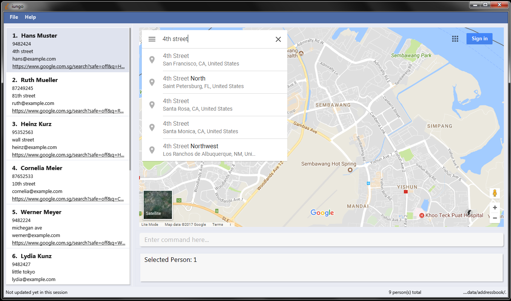

= iungo
ifdef::env-github,env-browser[:relfileprefix: docs/]
ifdef::env-github,env-browser[:outfilesuffix: .adoc]

image:https://travis-ci.org/CS2103AUG2017-F11-B3/main.svg?branch=master["Build Status", link="https://travis-ci.org/CS2103AUG2017-F11-B3/main"]
https://ci.appveyor.com/project/karrui/iungo/[image:https://ci.appveyor.com/api/projects/status/v48dd7x6xo44nr7l/branch/master?svg=true[Build status]]
https://coveralls.io/repos/github/CS2103AUG2017-F11-B3/main/badge.svg?branch=master[image:https://coveralls.io/repos/github/CS2103AUG2017-F11-B3/main/badge.svg?branch=master[Coverage Status]]
image:https://api.codacy.com/project/badge/Grade/e3e1a616ab2f47a7836dea6c8c7125e3["Codacy code quality", link="https://www.codacy.com/app/karrui/main?utm_source=github.com&utm_medium=referral&utm_content=CS2103AUG2017-F11-B3/main&utm_campaign=Badge_Grade"]

iungo aims to be an addressbook software for command-line aficionados. If you hate using the mouse for every small action, this application is for you!

ifdef::env-github[]

endif::[]

ifndef::env-github[]
image::images/Ui.png[width="600"]
endif::[]

/ˈjun.ɡoː/, [ˈjʊŋ.ɡoː] +
_verb_ - latin for _connect_

* This is a desktop Address Book application. It has a GUI but most of the user interactions happen using a CLI (Command Line Interface).
* This application targets users who is adept at using the keyboard, and prefers adding contacts solely with the keyboard, rather than using a mouse. As a result, most of the available commands can be done using just a keyboard.

=== Current version : `v1.4.1`

== Site Map

* <<UserGuide#, User Guide>>
* <<DeveloperGuide#, Developer Guide>>
* <<LearningOutcomes#, Learning Outcomes>>
* <<AboutUs#, About Us>>
* <<ContactUs#, Contact Us>>

== Acknowledgements

* iungo is built on a fork of https://github.com/nus-cs2103-AY1718S1/addressbook-level4[AddressBook - Level 4], which was developed by the https://se-edu.github.io/docs/Team.html[se-edu] team. +
* Some parts of this application were inspired by the excellent http://code.makery.ch/library/javafx-8-tutorial/[Java FX tutorial] by
_Marco Jakob_.

== Licence : link:LICENSE[MIT]
